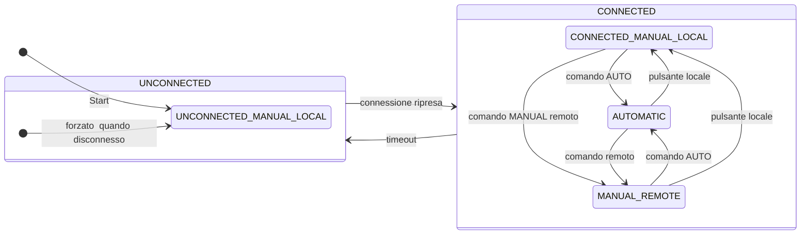
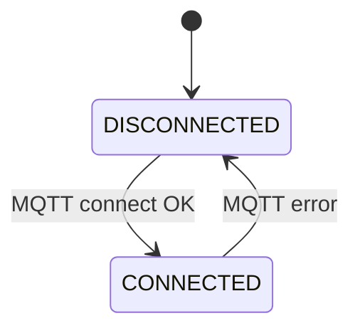
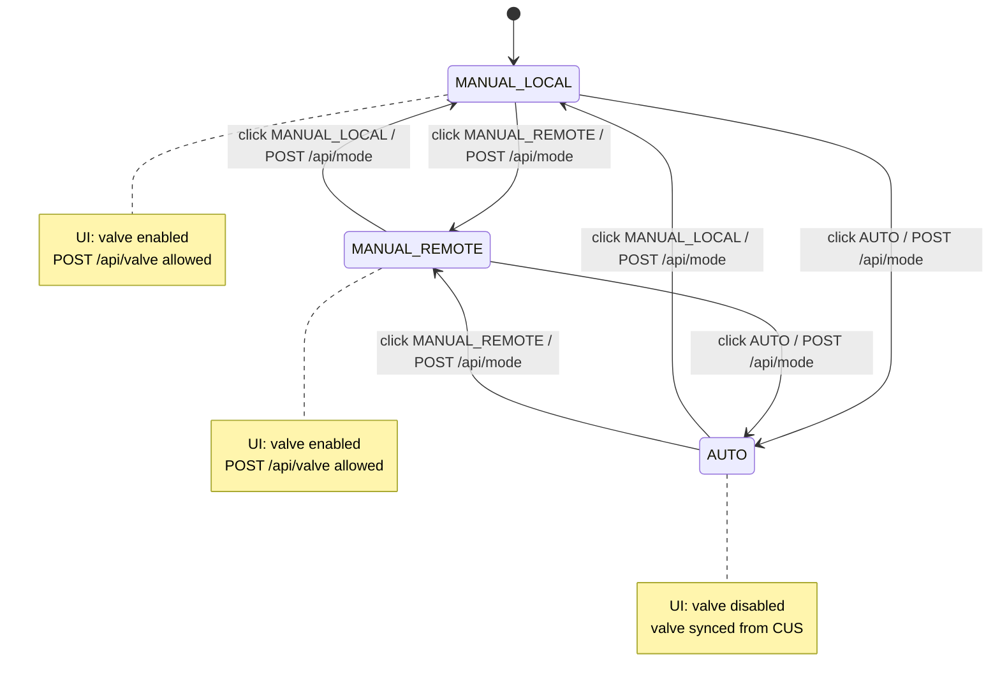
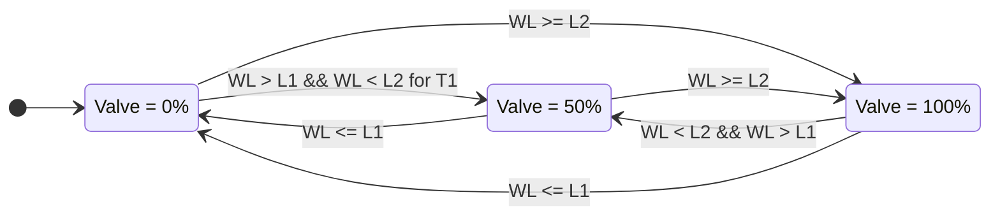
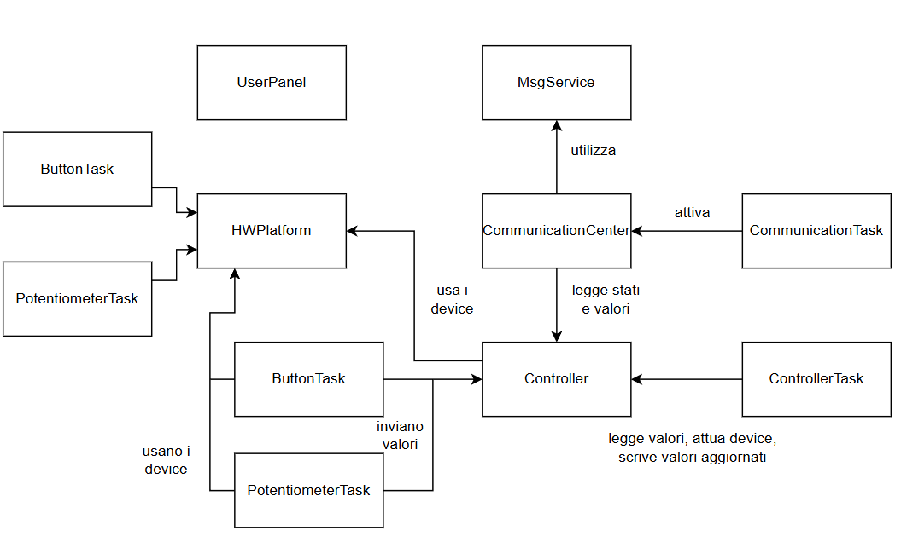
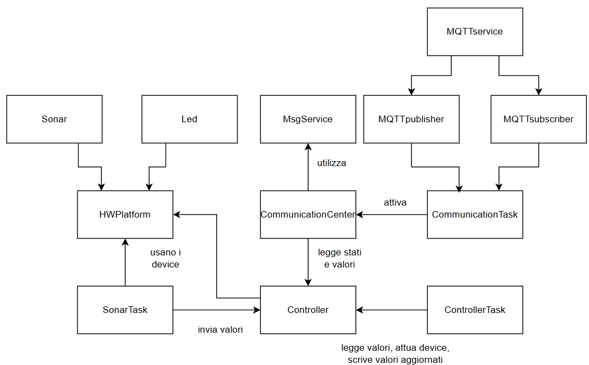
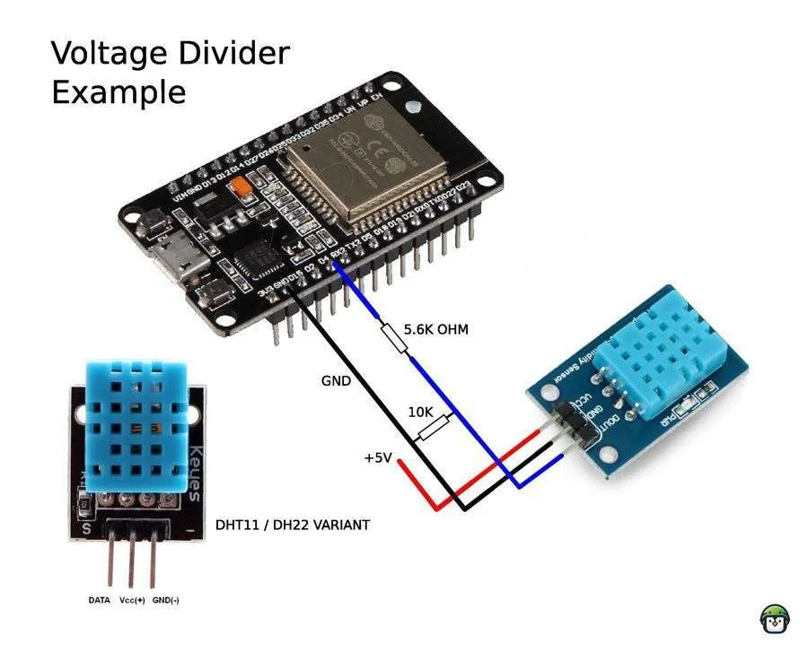

# Relazione 3o progetto

## Componenti principali
- Water Channel Subsystem (WCS) - Arduino
- Tank Monitoring subsystem (TMS) - ESP32
- Control Unit subsystem (CUS) - Back-end, running on a PC
- Dashboard subsystem (DBS) - Frontend/web app, running on the PC

## Stati WCS - Arduino
Gli stati della FSM sono stati modificati rispetto alle specifiche per necessità funzionali, in particolarità lo stato MANUAL è stato scomposto in :
- **MANUAL_REMOTE**: la valvola viene pilotata dall'interfaccia web del DBS.
- **CONNECTED_MANUAL_LOCAL**: la connessione è presente ma viene premuto il tasto per comandare la valvola in manuale dal WCS.
- **UNCONNECTED_MANUAL_LOCAL**: stato di default alla partenza del sistema e stato in cui il sistema viene forzato in caso di disconnessione.

## Stati TMS - ESP

Ho solo due stati che dipendono dalla connessione con l'MQTT broker.

### Stati DBS

**Stati possibili:**
- **MANUAL_LOCAL**
- **MANUAL_REMOTE**
- **AUTO**

**Transizioni (evento → azione)**

- Click **MANUAL_LOCAL**
    - POST `/api/mode {mode: MANUAL_LOCAL}`
    - stato `mode-store = MANUAL_LOCAL`
- Click **MANUAL_REMOTE**
    - POST `/api/mode {mode: MANUAL_REMOTE}`
    - stato `mode-store = MANUAL_REMOTE`
- Click **AUTO**
    - POST `/api/mode {mode: AUTO}`
    - stato `mode-store = AUTO`

**Effetti sul comportamento UI**
- **MANUAL_LOCAL / MANUAL_REMOTE**
    - Slider e bottone valvola **abilitati**
    - Dashboard può inviare `POST /api/valve`
- **AUTO**
    - Slider e bottone valvola **disabilitati**
    - Slider sincronizzato con il valore ricevuto da CUS

### Stati Controller Unit Subsystem (CUS)

Le due modalità gestite dal CUS sono la modalità **manuale** (`MANUAL_REMOTE`, `MANUAL_LOCAL`), e la modalità **automatica**. In quest'ultima modalità, lo stato della valvola può assumere tre stati: `AUTO_CLOSED`, `AUTO_OPEN_50`, `AUTO_OPEN_100`,  gestiti come nelle specifiche.

## Water Channel Subsystem (WCS) - Arduino

Il WCS controlla l'apertura e la chiusura della valvola. La posizione della valvola può essere decisa in modo manuale in locale tramite il potenziometro, modo manuale tramite l'interfaccia web o in modo automatico.
Comunica con il CUS tramite seriale inviando stringhe contenenti stato del sistema e la posizione della valvola.

Tutte le azioni vengono gestite tramite task periodici sincroni chiamati creati in main.cpp in setup() ed eseguiti dallo scheduler all'interno del loop(). Ogni task ha un periodo proprio. 
E' molto simile al TMS.

### HWPlatform
E' la classe dedicata all'inizializzazione di tutto l'hardware connesso all'Arduino, escluso quello usato per interfacciarsi con l'utente. Conserva i puntatori a tutte le istanze delle classi inizializzate che possono essere reperiti con gli appositi getter.

### UserPanel 
E' la classe dove vengono inizializzati e pilotati i device utilizzati per interfacciarsi con l'itente. In questo caso l'unico device è lo schermo LCD. Espone i metodi per interagire con questi device, come ad esempio i print sullo schermo. 

### Controller
Classe che recupera i puntatori da HWPlatform ai device ed espone i metodi per poterli pilotare. Ad esempio sono presenti i metodi per muovere il motore. 
Inoltre monitora gli stati e i valori di tutto il WCS.

### MsgService
Classe che inizializza la comunicazione tramite seriale ed espone metodi statici per usarlo per comunicarci con il CUS. Viene usata da CommunicationCenter.

### CommunicationCenter
Classe che usa MsgService per mandare e ricevere messaggi tramite seriale. Qui vengono letti gli stati del sistema e i valori di apertura della valvola e vengono mandati al CUS. Vengono anche ricevuti i messaggi dal CUS e gli stati del sistema vengono modificati di conseguenza. 

### CommunicationTask
Avvia la lettura e la ricezione di messaggi tramite CommunicationCenter.

### PotentiometerTask
Si occupa di fare polling per leggere il valore del potenziometro, di cui valore viene salvato in Controller.

### ButtonTask
Si occupa di fare polling per registrare input. Eventuali pressioni vengono salvate in Controller.

### ControllerTask
Si occupa di leggere stati e valori da Controller e di conseguenza cambia lo stato del sistema oppure avvia i device, in questo caso il motore.

## Tank Monitoring subsystem (TMS) - ESP32

Si occupa di monitorare il livello dell'acqua utilizzando un sonar HC-SR04. Si connette al wi-fi e comunica con l'MQTT broker del DBS a cui invia il valore misurato in formato json.

Tutte le azioni vengono gestite tramite task periodici sincroni chiamati creati in main.cpp in setup() ed eseguiti dallo scheduler all'interno del loop(). Ogni task ha un periodo proprio. 
E' molto simile al WCS.

![[Pasted image 20260207235829.png]]
### HWPlatform
E' la classe dedicata all'inizializzazione di tutto l'hardware connesso al ESP32, escluso quello usato per interfacciarsi con l'utente. Conserva i puntatori a tutte le istanze delle classi inizializzate che possono essere reperiti con gli appositi getter.

### UserPanel 
Non prevista, non ci interfacciamo direttamente con l'utente.

### Controller
Classe che recupera i puntatori da HWPlatform ai device ed espone i metodi per poterli pilotare. Ad esempio sono presenti i metodi leggere la distanza dal sonar. 
Inoltre monitora gli stati e i valori di tutto il TMS.

### MsgService
Classe che inizializza la comunicazione tramite seriale.

### MQTTservice
Classe padre di MQTTpublisher e MQTTsubscriber. Fornisce il metodo connect() per potersi connettere al broker MQTT.

### MQTTpublisher
Classe usata per fare il publish sul broker MQTT.

### MQTTsubscriber
Classe usata per fare il subscribe sul broker MQTT.

### CommunicationCenter
Classe che usa MsgService per mandare e ricevere messaggi tramite seriale. Qui vengono letti gli stati del sistema e i valori di apertura della valvola e vengono mandati al CUS. Vengono anche ricevuti i messaggi dal CUS e gli stati del sistema vengono modificati di conseguenza. 

### CommunicationTask
Avvia la lettura e la ricezione di messaggi tramite CommunicationCenter.

### SonarTask
Si occupa di fare polling per avviare la lettura della distanza dal sonar. La distanza viene salvata in Controller.

### ControllerTask
Si occupa di leggere stati e valori da Controller e di conseguenza cambia lo stato del TMS oppure controlla i device, in questo caso i led.
## Dashboard Subsystem (PC/Frontend)

Il **Dashboard Subsystem (DBS)** è un’applicazione web eseguita su PC che consente a un operatore remoto di **monitorare lo stato del sistema** e, quando consentito, di **inviare comandi di controllo**.
Il DBS è implementato come un’applicazione web basata su **Dash/Flask** e comunica **esclusivamente tramite HTTP** con il **Control Unit Subsystem (CUS)**.
Il DBS **non interagisce direttamente** con sensori o attuatori (ESP/Arduino), ma utilizza il CUS come **unico punto di integrazione** per l’accesso ai dati e l’invio dei comandi.

### Dashboard
L’applicazione web monitora lo stato del sistema interrogando periodicamente il CUS via HTTP e, in modalità manuale, consente all’operatore di inviare comandi di controllo per la valvola e la modalità di funzionamento.

### Voltage Divider
Per alimentare il sonar sono stati utilizzati la terra e il Vcc dell'arduino. Per non danneggiare l'ESP e quindi ottenere 3V è stato utilizzato un voltage divider. 

R1 (serie) 1kΩ: tra Echo del sensore e il GPIO dell'ESP32
R2 (a massa) 2kΩ: tra il GPIO dell'ESP32 e GND

Vout = 5V × R2 / (R1 + R2) = 5 × 2000 / 3000 ≈ 3.33V

## Control Unit Subsystem (PC/Backend)

Il **Control Unit Subsystem (CUS)** rappresenta il **livello centrale di coordinamento** dello Smart Tank Monitoring System.
È eseguito come un servizio Java su PC e funge da **punto di integrazione** tra i sottosistemi embedded (TMS e WCS) e il **Dashboard Subsystem (DBS)**.
Il CUS **non interagisce direttamente** con sensori o attuatori fisici; il suo compito è invece quello di **aggregare i dati**, **applicare le politiche di controllo a livello di sistema**, **gestire le modalità operative** e **fornire un’interfaccia unificata** verso la dashboard.

### RemoteBrokerClient
Implementa un client MQTT che si connette al broker, si sottoscrive al topic `/sensor/wl`, riceve i messaggi di water level dal sensore, li converte da JSON e aggiorna di conseguenza il `SystemController`.
### DataService
Implementa il servizio HTTP del CUS che espone al dashboard lo stato corrente del sistema (livello dell’acqua, modalità e valore della valvola) e consente di inviare comandi per cambiare modalità operativa e impostare manualmente la valvola.
### SerialCommChannel
Gestisce la comunicazione seriale tra CUS e Arduino, inviando messaggi terminati da newline e ricevendo dati in modo asincrono tramite eventi, ricostruendo le righe complete e mettendole in una coda da cui il programma può leggere.

### SystemController
Implementa il **SystemController** del CUS, mantenendo lo stato globale (WL, modalità MANUAL/AUTO e status) e applicando la policy di controllo con soglie e timeout (T1/T2) per determinare automaticamente lo stato e l’apertura della valvola.

### ChannelControllerManager
Gestisce il canale di comunicazione seriale tra CUS e Arduino, inviando comandi (stato o valore valvola) in formato JSON e leggendo i messaggi di ritorno dall’Arduino tramite una `SerialCommChannel`.